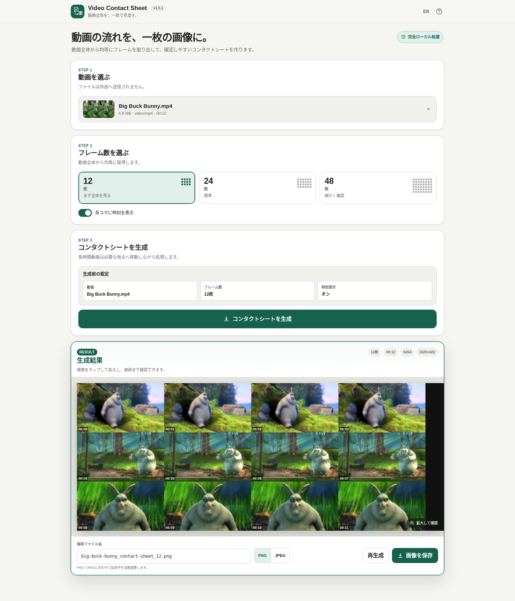

# Video Contact Sheet

[](https://github.com/ttomohisa/htmlapps-video-contact-sheet/actions/workflows/deploy-pages.yml)
[](LICENSE)
[](https://ttomohisa.github.io/htmlapps-video-contact-sheet/)

[English README](README.md)

動画全体から **12 / 24 / 48フレーム** を均等に取り出し、1枚のコンタクトシート画像へまとめる単一HTMLアプリです。動画はブラウザー内でローカル処理され、選択したファイルをサーバーへアップロードしません。



## デモ

### [GitHub PagesでVideo Contact Sheetを開く](https://ttomohisa.github.io/htmlapps-video-contact-sheet/)

インストールやアカウント登録は不要です。映画、画面録画、講義動画、長時間カメラ映像などの流れを、シークし続けずに一枚で確認できます。

## 主な機能

- 動画全体から **12 / 24 / 48フレーム** を均等に抽出
- 各フレームに時刻を表示可能
- MP4/MOV、MKV/WebM、AVI、MPEG-TSなどの一般的な動画形式に対応
- H.264、HEVC/H.265、VP8/VP9、AV1、MPEG-4、MJPEG、ProResなどをローカル処理
- 動画選択時に、ブラウザーが対応していれば軽量なサムネイルを表示
- **動画 → フレーム数 → 生成 → 結果** の分かりやすいワークフロー
- PCでは現在取り組んでいるSTEPをアクセント枠で強調
- スマホでは下部固定の **動画 / フレーム数 / 生成 / 結果** タブでページ切り替え
- STEP 3に **生成前の設定サマリー**（動画 / フレーム数 / 時刻表示）を表示
- 生成後に設定を変えると **「未反映の変更があります」** と表示
- 設定を変更しても現在の生成結果は保持し、**「コンタクトシートを生成」を押した時だけ結果を更新**
- 生成画像を全画面で拡大確認。ピンチ / ホイールでズーム、ドラッグで移動
- **全体表示 / 100%**、ダブルタップ / ダブルクリックによるズーム切り替え
- PNG / JPEG保存
- 保存ファイル名を編集可能。形式切替時は拡張子を自動調整
- 実行時ネットワーク通信を `connect-src 'none'` で遮断
- 日本語 / English切り替え

## 使い方

1. 動画をドロップするか、ファイル選択から動画を選びます。
2. **12 / 24 / 48フレーム** から確認したい細かさを選びます。
3. 必要に応じて「各コマに時刻を表示」を切り替えます。
4. STEP 3の設定サマリーを確認します。
5. **コンタクトシートを生成** を押します。
6. 生成結果を確認します。画像をタップ / クリックすると拡大ビューアが開きます。
7. 必要なら保存ファイル名とPNG / JPEGを変更し、**画像を保存** を押します。

### フレーム数の目安

| フレーム数 | 配置 | おすすめ用途 |
| ---: | --- | --- |
| **12** | 4 × 3 | まず動画全体の流れを素早く確認 |
| **24** | 6 × 4 | 通常利用。見やすさと情報量のバランスが良い |
| **48** | 8 × 6 | 長時間動画や場面変化を細かく確認 |

フレーム数を増やすほど時間方向の情報は細かくなりますが、1コマは小さくなります。スマートフォンでは生成後の拡大ビューアが便利です。

## 設定変更と再生成

生成後に動画、フレーム数、時刻表示を変更しても、現在表示中の生成結果は消えません。STEP 3に **「未反映の変更があります」** と表示され、新しい設定は次に **コンタクトシートを生成** を押したタイミングで反映されます。

同じ動画・同じフレーム数・同じ時刻表示設定のまま再生成を押した場合は、同じ処理を繰り返す代わりに、動画またはフレーム数を見直すための案内を表示します。

## ズーム操作

| 操作 | 動作 |
| --- | --- |
| 生成画像をタップ / クリック | 全画面ビューアを開く |
| 2本指ピンチ | スマホ・タブレットで拡大 / 縮小 |
| 1本指ドラッグ | 拡大中の画像を移動 |
| マウスホイール | PCで拡大 / 縮小 |
| マウスドラッグ | PCで拡大中の画像を移動 |
| ダブルタップ / ダブルクリック | 全体表示と100%を切り替え |
| **全体表示** | 画像全体が画面に収まる倍率へ戻す |
| **100%** | 実ピクセルサイズで表示 |

ズームは確認表示だけに作用し、保存される画像の解像度や内容は変わりません。

## 保存ファイル名

初期値は元動画名とフレーム数から作成されます。

```text
movie_contact-sheet_24.png
```

保存前に自由に編集できます。PNG / JPEGを切り替えた場合は、入力したベース名を保持して拡張子だけを自動調整します。

## 完全オフラインで使う

1. このリポジトリをダウンロードまたはクローンします。
2. Windowsで `build-standalone.bat` を実行します。
3. 初回だけ、`dependencies.json` で固定されたFFmpeg WASM BuilderのReleaseを取得します。
4. 生成された `dist/index.html` を任意の場所へコピーします。
5. 以降は、そのHTML単体をオフラインで直接開けます。

```powershell
.\build-standalone.bat
```

通常のビルドにPython、Node.js、ローカルWebサーバーは不要です。Windows PowerShellを使用します。

## 生成の仕組み

Video Contact Sheetは長時間動画を先頭から最後まで全フレーム順番に処理するのではなく、必要な位置へシークしてサンプルを取得します。

1. 選択した `File` / `Blob` をWORKERFSでマウント
2. 動画全体に12 / 24 / 48個の取得位置を配置
3. 各位置付近へシークして必要なフレームを取得
4. RGBへ変換して1枚のコンタクトシートへ配置
5. ページ側のCanvasへ描画
6. 必要なら時刻ラベルを描画
7. CanvasからPNG / JPEGとして保存

小さな動画サムネイルはブラウザー標準の `<video>` で取得する補助表示です。ブラウザーが直接再生できない形式ではサムネイルが出ない場合がありますが、本体のコンタクトシート生成には影響しない場合があります。

## GitHub Pagesで公開する

リポジトリには単一HTMLをビルドしてGitHub Pagesへ公開するワークフローが含まれています。

1. GitHubへプッシュします。
2. **Settings → Pages → Build and deployment → Source** で **GitHub Actions** を選択します。
3. `main` へプッシュするか、Actionsからデプロイワークフローを実行します。
4. ビルド成功後、`https://ttomohisa.github.io/htmlapps-video-contact-sheet/` で公開されます。

## 開発構成

```text
.
├─ src/index.template.html            # アプリ本体テンプレート
├─ video-contact-sheet.html           # 完全内包版HTML
├─ assets/
│  ├─ favicon.svg
│  └─ screenshot.png
├─ app.config.json                    # アプリ情報・バージョン
├─ dependencies.json                  # 固定依存バージョン
├─ build-standalone.bat               # Windows用ビルド入口
├─ build-standalone.ps1               # 単一HTML生成
├─ scripts/                            # 検証・依存更新スクリプト
├─ docs/                               # アーキテクチャ資料
└─ dist/                               # ビルド成果物
```

## プライバシーとライセンス

選択した動画はブラウザー内で処理されます。アプリのCSPでは実行時ネットワーク通信を遮断しています。

アプリ本体は [MIT License](LICENSE) です。生成される単一HTMLにはFFmpeg由来のコンポーネントが含まれます。ライセンスと対応ソース情報は [THIRD_PARTY_NOTICES.md](THIRD_PARTY_NOTICES.md) を参照してください。
