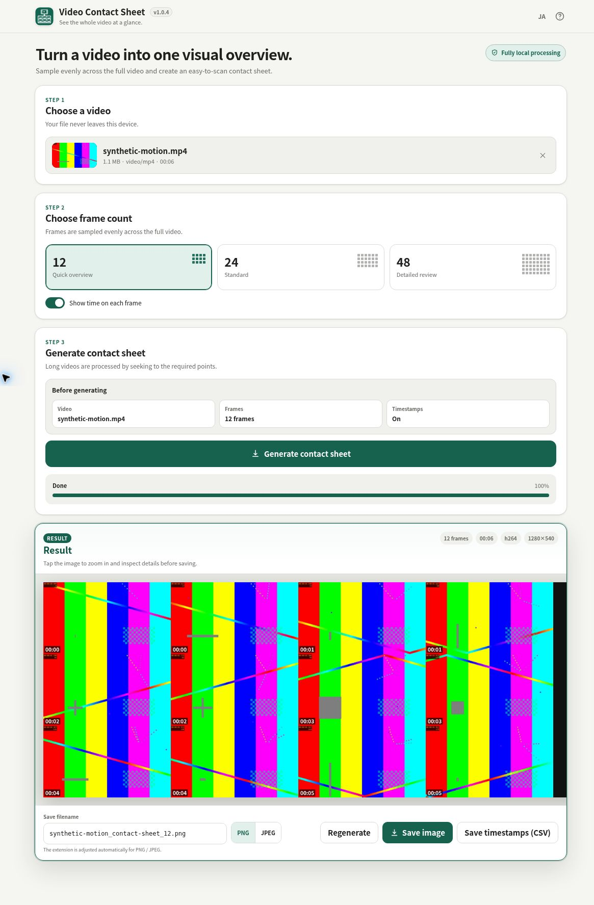

# Video Contact Sheet

[](https://github.com/ttomohisa/htmlapps-video-contact-sheet/actions/workflows/deploy-pages.yml)
[](LICENSE)
[](https://ttomohisa.github.io/htmlapps-video-contact-sheet/)

[日本語 README](README.ja.md)

Video Contact Sheet is a privacy-focused single-HTML app that samples **12 / 24 / 48 frames** evenly across a video and combines them into one contact sheet image. The selected video is processed locally in the browser and is not uploaded to a server.



## Demo

### [Open Video Contact Sheet on GitHub Pages](https://ttomohisa.github.io/htmlapps-video-contact-sheet/)

No installation or account is required. It is useful for quickly reviewing movies, screen recordings, lectures, long camera footage, and other videos without scrubbing through the entire timeline.

## Features

- Sample **12 / 24 / 48 frames** evenly across the full video
- Optional timestamp label on every frame
- Support common containers such as MP4/MOV, MKV/WebM, AVI, and MPEG-TS
- Local decoding for H.264, HEVC/H.265, VP8/VP9, AV1, MPEG-4, MJPEG, ProRes, and other enabled codecs
- Lightweight source thumbnail when browser-native decoding is available
- Clear **Video → Frames → Generate → Result** workflow
- Desktop highlights the step currently being worked on
- Mobile uses fixed **Video / Frames / Generate / Result** page tabs
- STEP 3 shows a **generation summary** for video, frame count, and timestamps
- After a successful generation, changed settings show **“Changes not yet applied”**
- Changing settings keeps the current result visible; the result is refreshed **only when Generate contact sheet is pressed**
- Full-screen result viewer with pinch / wheel zoom and drag panning
- **Fit / 100%** controls and double-tap / double-click zoom toggle
- Save as PNG or JPEG
- Export the generated sheet’s frame positions and actual decoded times as a local CSV
- Editable output filename with automatic extension normalization
- Runtime network access blocked with `connect-src 'none'`
- Japanese / English UI

## Usage

1. Drop a video onto the page or choose one from the file picker.
2. Choose **12 / 24 / 48 frames**.
3. Enable or disable timestamps as needed.
4. Review the generation summary in STEP 3.
5. Press **Generate contact sheet**.
6. Review the result. Tap or click the image to open the zoom viewer.
7. Edit the filename or switch PNG / JPEG if needed, then press **Save image**.
8. Optionally press **Save timestamps (CSV)** to download a review index for the current result.

### Frame count

| Frames | Layout | Best for |
| ---: | --- | --- |
| **12** | 4 × 3 | Fast overview of the entire video |
| **24** | 6 × 4 | Balanced default for normal use |
| **48** | 8 × 6 | Closer inspection of long or information-dense footage |

More frames provide a finer timeline overview, but each cell becomes smaller. The zoom viewer is especially useful for 48-frame results on a phone.

## Settings and regeneration

After a successful generation, changing the video, frame count, or timestamp option does not erase the current result. STEP 3 shows **“Changes not yet applied”**, and the new settings are applied the next time **Generate contact sheet** is pressed.

If regeneration is requested with exactly the same video, frame count, and timestamp setting, the app avoids repeating the same expensive operation and instead guides the user back to the video or frame-count settings.

## Zoom controls

| Control | Action |
| --- | --- |
| Tap / click the result | Open the full-screen viewer |
| Pinch | Zoom in / out on touch devices |
| One-finger drag | Pan while zoomed |
| Mouse wheel | Zoom in / out on desktop |
| Mouse drag | Pan while zoomed on desktop |
| Double-tap / double-click | Toggle fitted view and 100% |
| **Fit** | Fit the entire contact sheet |
| **100%** | Show actual pixel size |

Viewer zoom affects only inspection. It does not change the saved image or its resolution.

## Output filename

The initial filename is based on the source video and frame count, for example:

```text
movie_contact-sheet_24.png
```

You can edit it before saving. Switching between PNG and JPEG preserves the basename and normalizes only the extension.

## Timestamp CSV

**Save timestamps (CSV)** exports the last successfully generated sheet’s metadata with stable columns: `frame,row,column,actual_seconds,timestamp`. Frame, row, and column are 1-based sheet positions; rows retain the stored sample order. `actual_seconds` preserves the returned decoded time, while `timestamp` uses the same whole-second label as the image (not frame-accurate timecode), even with the overlay off.

Pending video, frame-count, or timestamp changes do not affect the CSV until successful regeneration. The CSV filename uses the displayed output basename plus `_timestamps.csv`; no source filename or user text is included in its cells. Missing or invalid metadata produces an inline error without a partial CSV. CSV export is local and does not decode frames or modify the image.

Each image save also retains the name and PNG/JPEG format chosen when Save was pressed, even if you edit the filename or switch format while encoding finishes.

## Fully offline use

1. Download or clone this repository.
2. Run `build-standalone.bat` on Windows.
3. The first build downloads the exact FFmpeg WASM Builder release pinned in `dependencies.json`.
4. Copy the generated `dist/index.html` wherever you need it.
5. Open that single file later without an internet connection.

```powershell
.\build-standalone.bat
```

Python, Node.js, and a local web server are not required for the normal build. Windows PowerShell is used.

## How generation works

Video Contact Sheet does not decode every frame from beginning to end. It seeks to the positions needed for the contact sheet.

1. Mount the selected `File` / `Blob` through WORKERFS
2. Choose 12 / 24 / 48 positions across the duration
3. Seek near each target and decode the needed frame
4. Convert samples to RGB and arrange them into one sheet
5. Render the sheet to Canvas
6. Add timestamp labels when enabled
7. Save the Canvas as PNG or JPEG

The small source thumbnail uses the browser's native `<video>` decoder as an optional preview. It may be unavailable for formats the browser itself cannot decode even when the main contact-sheet generation path supports them.

## Publish with GitHub Pages

The repository includes a workflow that builds the standalone HTML and deploys it to GitHub Pages.

1. Push the repository to GitHub.
2. In **Settings → Pages → Build and deployment → Source**, choose **GitHub Actions**.
3. Push to `main` or run the deployment workflow manually.
4. After a successful deployment, the app is available at `https://ttomohisa.github.io/htmlapps-video-contact-sheet/`.

## Repository layout

```text
.
├─ src/index.template.html            # Application template
├─ video-contact-sheet.html           # Fully embedded standalone HTML
├─ assets/
│  ├─ favicon.svg
│  └─ screenshot.png
├─ app.config.json                    # App metadata and version
├─ dependencies.json                  # Pinned dependency versions
├─ build-standalone.bat               # Windows build entry point
├─ build-standalone.ps1               # Single-HTML builder
├─ scripts/                            # Validation and dependency-update scripts
├─ docs/                               # Architecture documentation
└─ dist/                               # Generated build artifacts
```

## Privacy and licenses

The selected video is processed locally in the browser. The app's CSP blocks runtime network access.

The application source is released under the [MIT License](LICENSE). The generated standalone HTML also contains FFmpeg-derived components; see [THIRD_PARTY_NOTICES.md](THIRD_PARTY_NOTICES.md) for licenses and corresponding-source information.
